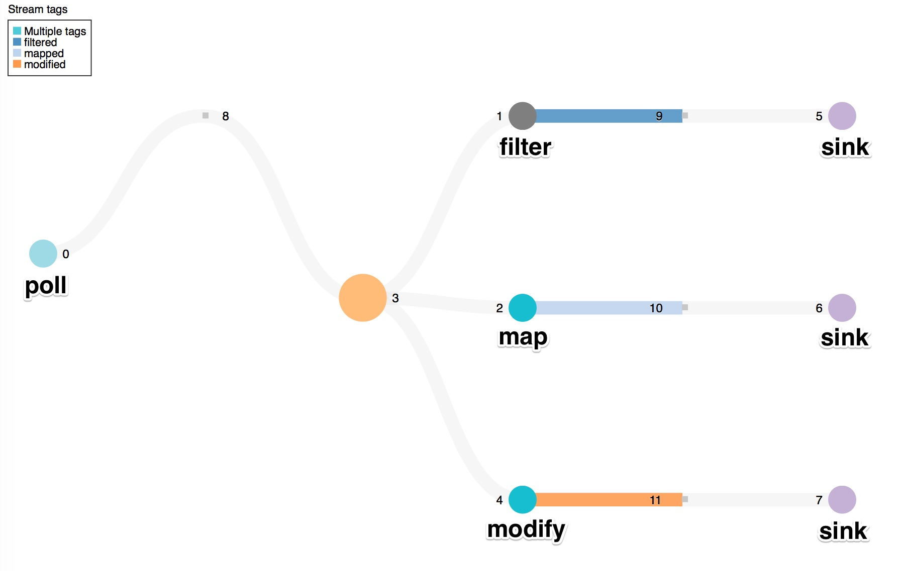

In the previous [recipe](recipe_value_out_of_range), we learned how to filter a stream to obtain the interesting sensor readings and ignore the mundane data. Typically, a user scenario is more involved, where data is processed using different stream operations. Consider the following scenario, for example.

Suppose a package delivery company would like to monitor the gas mileage of their delivery trucks using embedded sensors. They would like to apply different analytics to the sensor data that can be used to make more informed business decisions. For instance, if a truck is reporting consistently poor gas mileage readings, the company might want to consider replacing that truck to save on gas costs. Perhaps the company also wants to convert the sensor readings to JSON format in order to easily display the data on a web page. It may also be interested in determining the expected gallons of gas used based on the current gas mileage.

In this instance, we can take the stream of gas mileage sensor readings and apply multiple types of processing against it so that we end up with streams that serve different purposes.

## Setting up the application

We assume that the environment has been set up following the steps outlined in the [Getting started guide](../docs/edgent-getting-started). Let's begin by creating a `DirectProvider` and `Topology`. We choose a `DevelopmentProvider` so that we can view the topology graph using the console URL (refer to the [Application console](../docs/console) page for a more detailed explanation of this provider). The gas mileage bounds, initial gas mileage value, and the number of miles in a typical delivery route have also been defined.

```java
import java.text.DecimalFormat;
import java.util.concurrent.TimeUnit;

import com.google.gson.JsonObject;

import org.apache.edgent.analytics.sensors.Ranges;
import org.apache.edgent.console.server.HttpServer;
import org.apache.edgent.providers.development.DevelopmentProvider;
import org.apache.edgent.providers.direct.DirectProvider;
import org.apache.edgent.samples.utils.sensor.SimpleSimulatedSensor;
import org.apache.edgent.topology.TStream;
import org.apache.edgent.topology.Topology;

public class ApplyDifferentProcessingAgainstStream {
    /**
     * Gas mileage (in miles per gallon, or mpg) value bounds
     */
    static double MPG_LOW = 7.0;
    static double MPG_HIGH = 14.0;
    /**
     * Initial gas mileage sensor value
     */
    static double INITIAL_MPG = 10.5;
    /**
     * Hypothetical value for the number of miles in a typical delivery route
     */
    static double ROUTE_MILES = 80;

    public static void main(String[] args) throws Exception {

        DirectProvider dp = new DevelopmentProvider();

        System.out.println(dp.getServices().getService(HttpServer.class).getConsoleUrl());

        Topology top = dp.newTopology("GasMileageSensor");

        // The rest of the code pieces belong here
    }
}
```

## Generating gas mileage sensor readings

The next step is to simulate a stream of gas mileage readings using [`SimpleSimulatedSensor`]({{ site.data.project.source_repository_mirror }}/blob/master/samples/utils/src/main/java/{{ site.data.project.unix_name }}/samples/utils/sensor/SimpleSimulatedSensor.java). We set the initial gas mileage and delta factor in the first two arguments. The last argument ensures that the sensor reading falls in an acceptable range (between 7.0 mpg and 14.0 mpg). In our `main()`, we use the `poll()` method to generate a flow of tuples (readings), where each tuple arrives every second.

```java
// Generate a stream of gas mileage sensor readings
SimpleSimulatedSensor mpgSensor = new SimpleSimulatedSensor(INITIAL_MPG,
        0.4, Ranges.closed(MPG_LOW, MPG_HIGH));
TStream<Double> mpgReadings = top.poll(mpgSensor, 1, TimeUnit.SECONDS);
```

## Applying different processing to the stream

The company can now perform analytics on the `mpgReadings` stream and feed it to different functions.

First, we can filter out gas mileage values that are considered poor and tag the resulting stream for easier viewing in the console.

```java
// Filter out the poor gas mileage readings
TStream<Double> poorMpg = mpgReadings
        .filter(mpg -> mpg <= 9.0).tag("filtered");
```

If the company also wants the readings to be in JSON, we can easily create a new stream and convert from type `Double` to `JsonObject`.

```java
// Map Double to JsonObject
TStream<JsonObject> json = mpgReadings
        .map(mpg -> {
            JsonObject jObj = new JsonObject();
            jObj.addProperty("gasMileage", mpg);
            return jObj;
        }).tag("mapped");
```

In addition, we can calculate the estimated gallons of gas used based on the current gas mileage using `modify`.

```java
// Modify gas mileage stream to obtain a stream containing the estimated gallons of gas used
DecimalFormat df = new DecimalFormat("#.#");
TStream<Double> gallonsUsed = mpgReadings
        .modify(mpg -> Double.valueOf(df.format(ROUTE_MILES / mpg))).tag("modified");
```

The three examples demonstrated here are a small subset of the many other possibilities of stream processing.

With each of these resulting streams, the company can perform further analytics, but at this point, we terminate the streams by printing out the tuples on each stream.

```java
// Terminate the streams
poorMpg.sink(mpg -> System.out.println("Poor gas mileage! " + mpg + " mpg"));
json.sink(mpg -> System.out.println("JSON: " + mpg));
gallonsUsed.sink(gas -> System.out.println("Gallons of gas: " + gas + "\n"));
```

We end our application by submitting the `Topology`.

## Observing the output

When the final application is run, the output looks something like the following:

```
JSON: {"gasMileage":9.5}
Gallons of gas: 8.4

JSON: {"gasMileage":9.2}
Gallons of gas: 8.7

Poor gas mileage! 9.0 mpg
JSON: {"gasMileage":9.0}
Gallons of gas: 8.9

Poor gas mileage! 8.8 mpg
JSON: {"gasMileage":8.8}
Gallons of gas: 9.1
```

## A look at the topology graph

Let's see what the topology graph looks like. We can view it using the console URL that was printed to standard output at the start of the application. We see that original stream is fanned out to three separate streams, and the `filter`, `map`, and `modify` operations are applied.



## The final application

```java
import java.text.DecimalFormat;
import java.util.concurrent.TimeUnit;

import com.google.gson.JsonObject;

import org.apache.edgent.analytics.sensors.Ranges;
import org.apache.edgent.console.server.HttpServer;
import org.apache.edgent.providers.development.DevelopmentProvider;
import org.apache.edgent.providers.direct.DirectProvider;
import org.apache.edgent.samples.utils.sensor.SimpleSimulatedSensor;
import org.apache.edgent.topology.TStream;
import org.apache.edgent.topology.Topology;

 /**
 * Fan out stream and perform different analytics on the resulting streams.
 */
public class ApplyDifferentProcessingAgainstStream {
    /**
     * Gas mileage (in miles per gallon, or mpg) value bounds
     */
    static double MPG_LOW = 7.0;
    static double MPG_HIGH = 14.0;
    /**
     * Initial gas mileage sensor value
     */
    static double INITIAL_MPG = 10.5;
    /**
     * Hypothetical value for the number of miles in a typical delivery route
     */
    static double ROUTE_MILES = 80;

    /**
     * Polls a simulated delivery truck sensor to periodically obtain
     * gas mileage readings (in miles/gallon). Feed the stream of sensor
     * readings to different functions (filter, map, and modify).
     */
    public static void main(String[] args) throws Exception {

        DirectProvider dp = new DevelopmentProvider();

        System.out.println(dp.getServices().getService(HttpServer.class).getConsoleUrl());

        Topology top = dp.newTopology("GasMileageSensor");

        // Generate a stream of gas mileage sensor readings
        SimpleSimulatedSensor mpgSensor = new SimpleSimulatedSensor(INITIAL_MPG,
                0.4, Ranges.closed(MPG_LOW, MPG_HIGH));
        TStream<Double> mpgReadings = top.poll(mpgSensor, 1, TimeUnit.SECONDS);

        // Filter out the poor gas mileage readings
        TStream<Double> poorMpg = mpgReadings
                .filter(mpg -> mpg <= 9.0).tag("filtered");

        // Map Double to JsonObject
        TStream<JsonObject> json = mpgReadings
                .map(mpg -> {
                    JsonObject jObj = new JsonObject();
                    jObj.addProperty("gasMileage", mpg);
                    return jObj;
                }).tag("mapped");

        // Modify gas mileage stream to obtain a stream containing the estimated gallons of gas used
        DecimalFormat df = new DecimalFormat("#.#");
        TStream<Double> gallonsUsed = mpgReadings
                .modify(mpg -> Double.valueOf(df.format(ROUTE_MILES / mpg))).tag("modified");

        // Terminate the streams
        poorMpg.sink(mpg -> System.out.println("Poor gas mileage! " + mpg + " mpg"));
        json.sink(mpg -> System.out.println("JSON: " + mpg));
        gallonsUsed.sink(gas -> System.out.println("Gallons of gas: " + gas + "\n"));

        dp.submit(top);
    }
}
```
